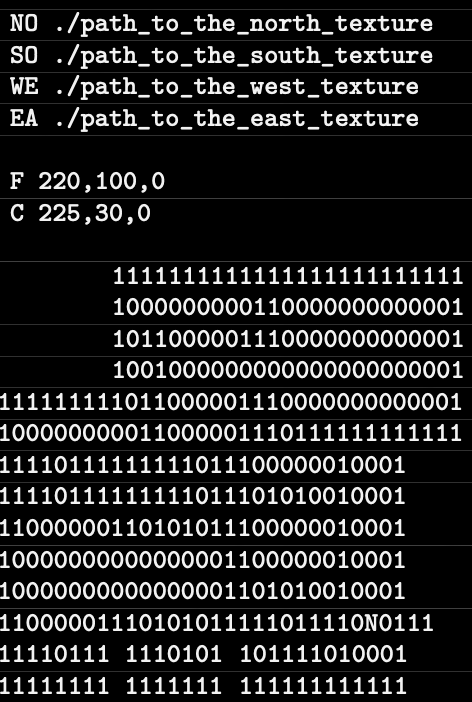

# Wolfenstein 3D Inspired Project

This project draws inspiration from the iconic Wolfenstein 3D game, renowned as the pioneer of first-person shooter (FPS) games. Our aim is to simulate a dynamic view within a maze, challenging players to navigate and find their way out.

The core concept behind this project is ray casting, a fundamental technique in computer graphics rendering. We've employed the MiniLibX graphics library, adhering to project requirements.

## Contributors

- Abbas Toof
- Eemeli Mustonen

## Demo View

Here's a glimpse of what to expect:

## Getting Started

To run the project, follow these steps:

1. Execute `make` in the root directory of the repository.
2. Start the game with `./cub3D <path_to_cub_file>`.
3. To exit, press `ESC` or click the window's close button.

## Controls

- **Look Around**: Left or Right Arrow Keys
- **Movement**: W, A, S, D Keys
- **Point of View Rotation**: Mouse Movement

## .cub File Format

The `.cub` file serves as a scene descriptor with the following specifications:

### Wall Textures

Define four wall textures with the specifiers: NO, EA, SO, WE.

Format: `<specifier> <path_to_texture>`

### Floor and Ceiling Colors

Specify floor and ceiling colors with: F and C.

Format: `<specifier> <R>, <G>, <B>` (RGB values range from 0 to 255)

### Map Configuration

The map should be the final section of the `.cub` file, without any empty lines within the map content. It must:

- Use `1` for walls and `0` for empty spaces. Spaces denote voids.
- Be enclosed by walls.
- Indicate the player's spawn point and orientation: N (north), E (east), S (south), W (west).

### Example .cub File

## Bonus Features

- Minimap
- Wall Collision Detection
- Mouse-Controlled View Rotation
